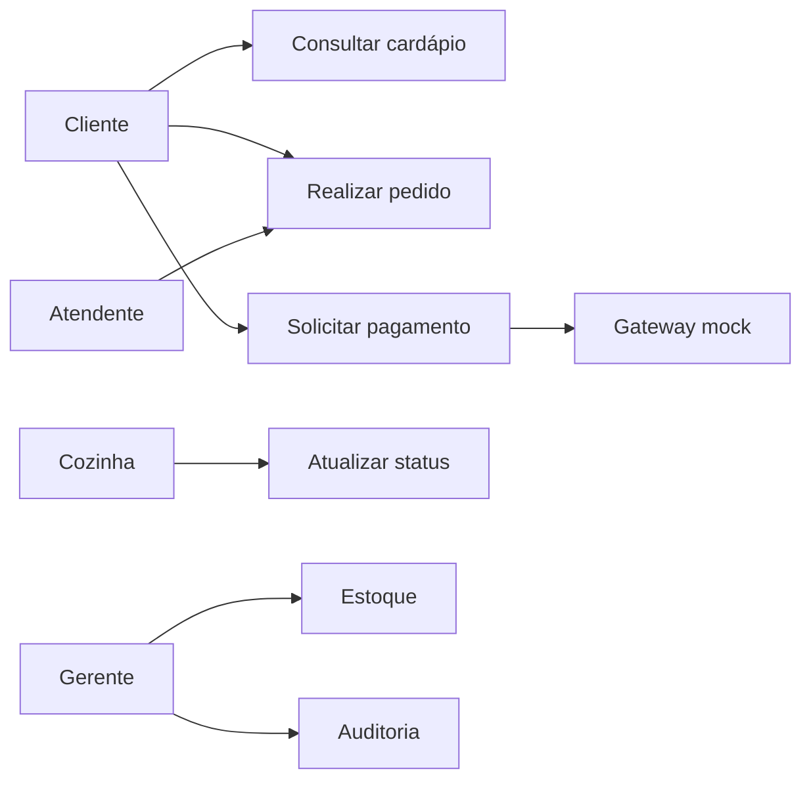
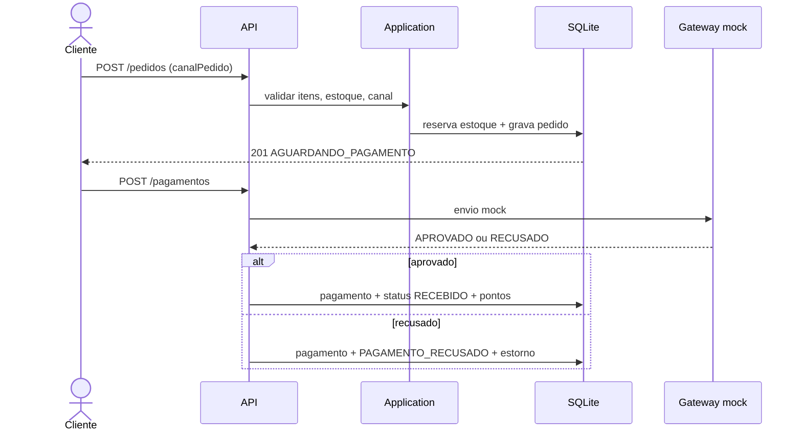

# Diagramas — Raízes do Nordeste

Figuras em `docs/figuras/` (também no PDF acadêmico). Gerar de novo: `python scripts/gerar_diagramas.py`.

## Casos de uso

Arquivo: `docs/figuras/casos_de_uso.png`

Atores: Cliente (App/Web/Totem), Atendente, Cozinha, Gerente/Admin, Gateway de pagamento (mock).

Casos: autenticar, consultar cardápio, realizar pedido, solicitar pagamento, atualizar status, cancelar, movimentar estoque, fidelidade, auditar.

O fluxo crítico (pedido + pagamento) está detalhado no Anexo A do relatório.

## Sequência do fluxo crítico

Arquivo: `docs/figuras/sequencia.png`

## DER

Arquivo: `docs/figuras/der.png` (entregável visual pedido no roteiro).

- Unidade 1-N CardapioUnidade N-1 Produto
- Unidade 1-N Estoque N-1 Produto (estoque próprio)
- Usuario 0-N Pedido N-1 Unidade
- Pedido 1-N ItemPedido N-1 Produto
- Pedido 1-1 Pagamento (desacoplado)
- Usuario 0-1 ContaFidelidade 1-N MovimentoFidelidade
- Usuario 0-N Consentimento / LogAuditoria
- Pedido.canalPedido: APP | TOTEM | BALCAO | PICKUP | WEB

Fonte de verdade das colunas: `prisma/schema.prisma`.

## Arquitetura e classes

- `docs/figuras/arquitetura.png` — Domain / Application / Infrastructure / API
- `docs/figuras/classes.png` — visão de domínio (Pedido, Estoque, PagamentoMock, pedido-regras)
